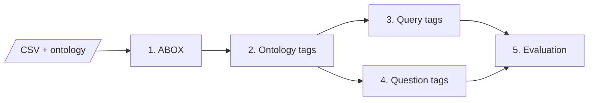
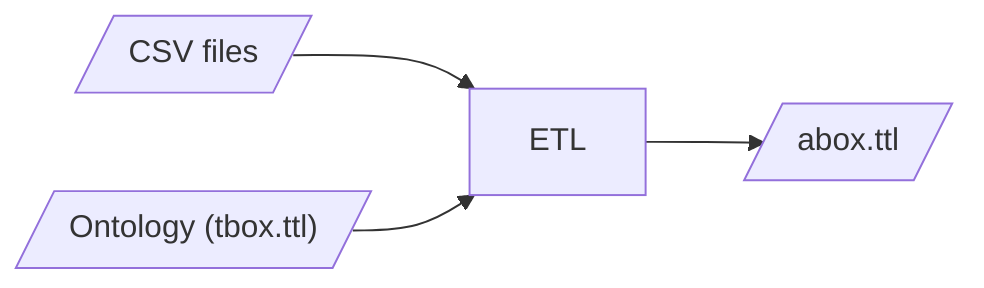
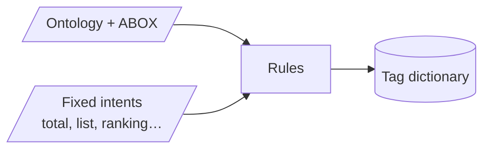
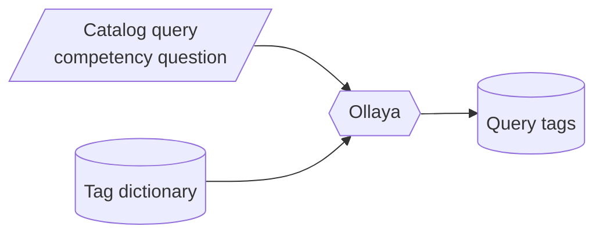
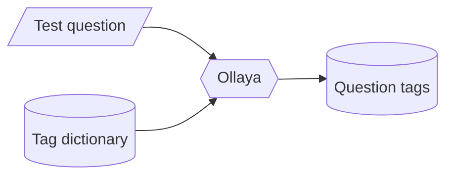
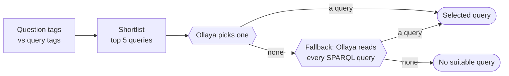
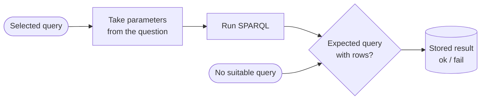

# Architecture overview

wsparql answers a question in plain language by picking a SPARQL query from a catalog, filling in its parameters and
running it on the profile's data. Ollaya is the language model that reads the questions. Full details:
[ARCHITECTURE.md](ARCHITECTURE.md).

## 1. ABOX generation

Each CSV file is one class and each row is one record. The ontology says what each column means: a link to another
record, or a typed value such as a date or an amount. The output is a validated RDF graph.

## 2. Ontology tags extraction

Classes, categories and numeric or date properties of the ontology become tags. Fixed intent tags, which describe the
shape of the answer (total, list, ranking…), are added to them. Each tag has a short description for Ollaya to read.
This step does not call Ollaya.

## 3. cq_tag_assessment

Ollaya reads each query's competency question and scores every tag. The tags that score 0.5 or more become that
query's tags.

## 4. question_tag_assessment

Ollaya scores the same tags on each test question. The scores are cached, so the evaluation does not need to call
Ollaya for tags again.

## 5. question_eval

Each test question goes through two stages: choosing a query, then running it and scoring the result.

### 5a. Choose the query

The question's tags are compared with each query's tags, and the 5 best matches are shortlisted. Ollaya picks one of
them by reading their competency questions. If none fits, Ollaya gets a second chance: it reads the SPARQL text of the
whole catalog and picks from that. That second answer is final, and it may also be none.

### 5b. Run and score

The query's parameters, such as a project, a person or a date range, are taken from the question, and the query is
run. The result counts as ok when the expected query was chosen and returned rows, or when the expected answer was
"no suitable query" and none was chosen. Each result is stored, so successive evaluations can be compared.
