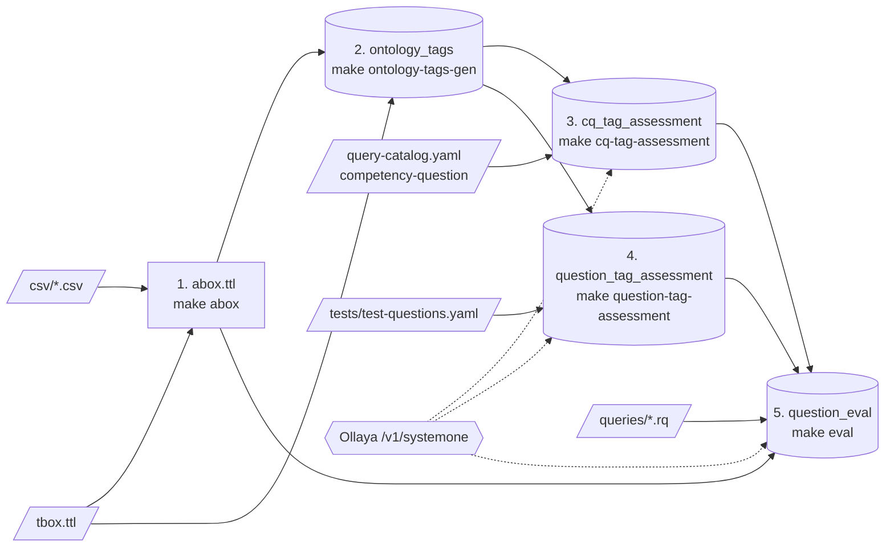
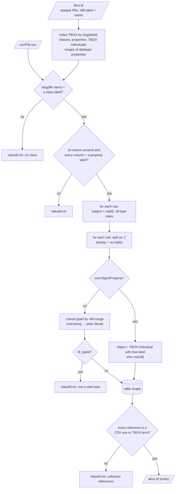
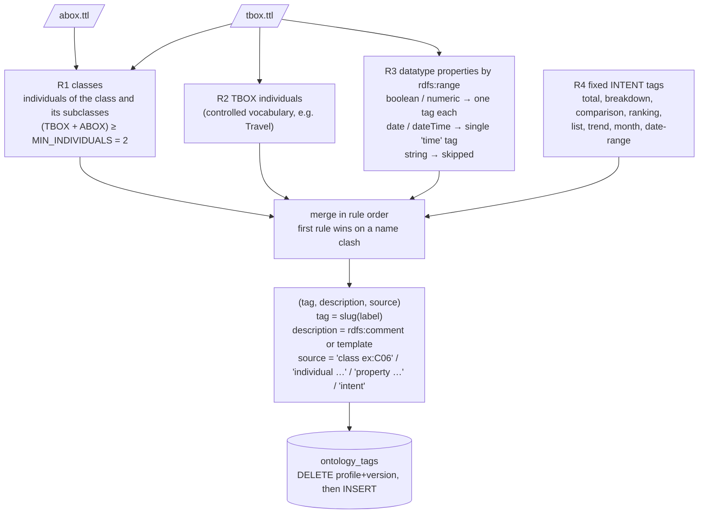
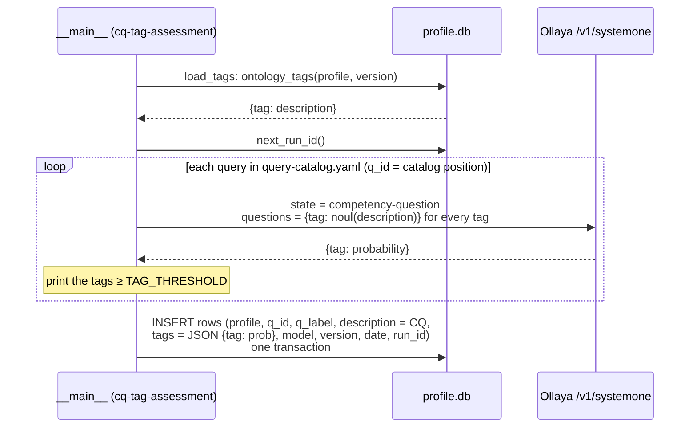
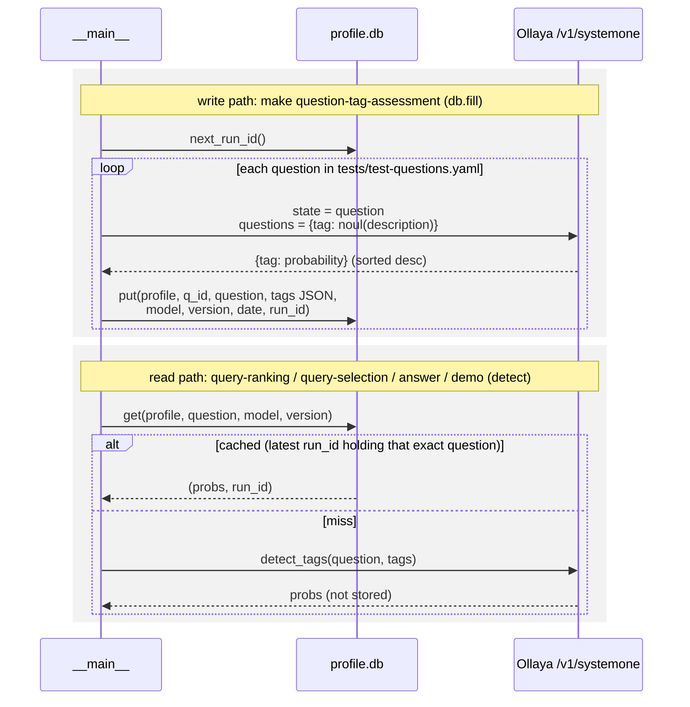
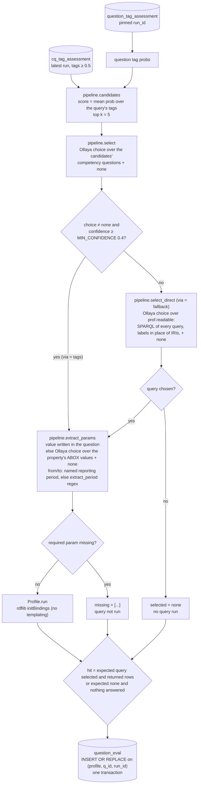

# Architecture

wsparql answers natural-language questions by choosing a hand-written SPARQL query from a catalog, filling its
parameters and running it with rdflib on a profile's ontology (`tbox.ttl`) and data (`abox.ttl`). Ollaya (`/v1/systemone`,
called through `ollaya.decide`) answers the typed questions: `noul` (a probability for each tag) and `choice` (pick one option or `none`).

A profile is a directory under `profile/` (`eu-expense-poc`, `c3po`) selected by `PROFILE`. The derived data lives in
two places: `abox.ttl` in the profile directory, and four tables of `profile/profile.db`. That SQLite file is
git-ignored and shared by all profiles. Each row carries its profile and VERSION, and the Ollaya rows also carry the model.

## Overview

`make build` runs steps 1 to 4 in order. `make eval` runs step 5. Steps 1 and 2 are deterministic and do not call Ollaya.
Steps 3 and 4 each get a new `run_id` from a single counter shared by both tables (`ProfileDb.next_run_id` over
`RUN_TABLES`). Step 5 is keyed by the `run_id` of the question tags it used.

| Module | Role |
|---|---|
| `wsparql/__main__.py` | CLI (argparse subcommands, one per make target), printing, `load_tags`, `detect`, eval loop |
| `wsparql/etl.py` | CSV + TBOX → ABOX graph |
| `wsparql/tags.py` | tag dictionary rules, `slug` / `words` naming helpers |
| `wsparql/ollaya.py` | HTTP client: `decide`, `detect_tags` |
| `wsparql/pipeline.py` | ranking, selection, fallback, parameter extraction, `answer` |
| `wsparql/profile.py` | loads a profile: graph, catalog, queries, readable SPARQL, test questions, `run` |
| `wsparql/db.py` | `ProfileDb` schema and accessors, `fill` |

## 1. ABOX generation

`make abox` → `etl.write(path)` → `etl.build(path)` → `abox.ttl` (committed, rerun after editing a CSV).

**How the data is generated.** No mapping file is needed because the TBOX is the schema. TBOX IRIs are opaque (`ex:C06`,
`ex:P14`, `ex:I02`), so `rdfs:label` gives each term its name. Names are compared as slugs (`tags.slug`), so
`EuropeanProject.csv` matches the class labeled `European project` and the column `expenseDate` matches the property
`expense date`. The namespace and prefix come from the TBOX classes (`ex:`, `c3po:`). Each row becomes a subject
`ns[id]` typed by the class named after the file. For each column:

- **Object property cell**: becomes an IRI. It resolves to a TBOX individual when one has that label (`Travel` → `ex:I02`), otherwise to the CSV row `ns[cell]`.
- **Datatype property cell**: becomes a literal typed by the property's `rdfs:range`.

`|` separates multiple values in a cell, and an empty cell produces no triple. There is no inference: each relation is
stored once, in one direction, and queries walk it with explicit joins. Any inconsistency (unknown file or column,
empty id, ill-typed value, dangling reference) aborts the build, so a bad `abox.ttl` is never written. Details:
[GENERATE-ABOX.md](GENERATE-ABOX.md).

## 2. Ontology tags extraction

`make ontology-tags-gen` (depends on `abox`) → `tags.generate(path)` → `ProfileDb.put_ontology_tags` → table `ontology_tags`.

**How the data is generated.** The tag dictionary is computed from the ontology instead of being written by hand. Each rule
turns ontology terms into tags whose name is the slug of the term's label:

- **R1**: classes that have at least two individuals, counting their subclasses' individuals as well. A class with a single individual cannot tell questions apart.
- **R2**: individuals declared in the TBOX. ABOX individuals are not tags: they are parameter values.
- **R3**: discriminating datatype properties. All date properties collapse into one `time` tag. String properties are skipped because they hold identity values.
- **R4**: eight question-shape intents. No ontology contains these, so they are defined in `tags.INTENT`.

The `description` is what Ollaya reads: it becomes the `noul` instruction for that tag. Tag names never reach Ollaya.
The result is deterministic, so there is no `run_id`: each run replaces the rows for the profile version in a single
transaction. Every command except `sparql`, `expected` and `eval-direct` loads the dictionary through
`__main__.load_tags` and exits with `make ontology-tags-gen` as the fix when it is missing. Details:
[GENERATE-TAGS-FROM-ONTOLOGY.md](GENERATE-TAGS-FROM-ONTOLOGY.md).

## 3. cq_tag_assessment

`make cq-tag-assessment` (depends on `ontology-tags-gen`) → the `cq-tag-assessment` branch of `__main__.main` → `ollaya.detect_tags` per catalog query →
`ProfileDb.put_cq_tag_assessment` → table `cq_tag_assessment`.

**How the data is generated.** Tags are assigned to each catalog query by reading its `competency-question` with the
whole dictionary, exactly the way a user question is read. One Ollaya call per query sends one `noul` per tag and
returns a probability for each tag. The full `{tag: probability}` map is stored as JSON together with the competency
question text as it was at run time. Each invocation appends a new `run_id`, so older runs are kept.

**How it is consumed.** `load_tags(prof, db, with_assessment=True)` reads the latest run for the profile, model and
version (`ProfileDb.cq_tag_assessment`). It sets `catalog[qid]["tags"]` to the tags with probability ≥
`pipeline.TAG_THRESHOLD` (0.5). Because the probabilities are stored, the threshold can change without calling Ollaya
again. The commands `query-ranking`, `query-selection`, `answer`, `demo` and `eval` refuse to run when any catalog query
is missing from that run.

## 4. question_tag_assessment

`make question-tag-assessment` (depends on `ontology-tags-gen`) → `db.fill(prof, db, model)` → table
`question_tag_assessment`. It is also read on demand by `__main__.detect`.

**How the data is generated.** This is the same `detect_tags` call as in step 3, applied to every test question, and
all rows of one fill share one `run_id`. Each row is written in its own transaction, so an interrupted fill keeps the
questions already done, under a `run_id` that `make eval` will reject as incomplete. Lookups match on the exact
question text plus profile, model and version. A VERSION bump or a model switch is therefore a cache miss, never a
stale hit. Interactive commands use the latest cached run and call Ollaya live on a miss without storing the result.
`make eval` instead pins the latest `run_id` (`ProfileDb.last_run_id`) and requires every labeled question to be in it.

## 5. question_eval

`make eval` → the `eval` branch of `__main__.main` → for each labeled test question, `pipeline.answer(question,
cached_probs, prof)` → `ProfileDb.put_evals` → table `question_eval`.

**How the data is generated.** `make eval` loads the dictionary and the query tags (steps 2 and 3) and pins the latest
question-tag `run_id` (step 4). It then answers every question that has an `expected_query` without calling Ollaya for
tags. Each answer goes through these stages:

1. **Ranking**: catalog queries are ranked by the mean detected probability of their tags.
2. **Selection**: Ollaya picks one of the top 5 by competency question, or `none`.
3. **Fallback**: only when the tag route says none, one more choice is made over the readable SPARQL of the whole catalog. Its answer is final.
4. **Parameter extraction**: parameters are taken from the question. A value written verbatim wins. Otherwise an Ollaya choice over the property's ABOX values is used. Dates come from a named reporting period (c3po) or a quarter/month/year regex.
5. **Execution**: the query runs only if every required parameter was found. An optional parameter that was not found leaves its variable unbound.

Each row stores:

| Column | Content |
|---|---|
| `q_id`, `question`, `expected` | the test question and its expected query |
| `selected` | catalog id or `none` |
| `confidence` | confidence of the selection |
| `params` | JSON of the bound values |
| `missing` | required parameters that were not found |
| `row_count` | number of result rows, NULL if no query ran |
| `ok` | hit (1) or miss (0) |
| `model`, `version`, `run_id`, `date` | `run_id` = the question-tag run used; one `date` per eval |

Rows replace any earlier eval of the same `(profile, q_id, run_id)` in a single transaction, so an interrupted eval
stores nothing. Before writing, `ProfileDb.prev_eval` fetches the previous eval of that `run_id`, and the CLI reports
which `q_id` changed. The summary prints two scores: N/M with the fallback and N/M for the tag route alone. The command
exits 1 on any miss.

`make eval-direct` is a baseline without tags: `pipeline.answer(..., direct=True)` calls only `select_direct`. Its
results are printed but not stored.
